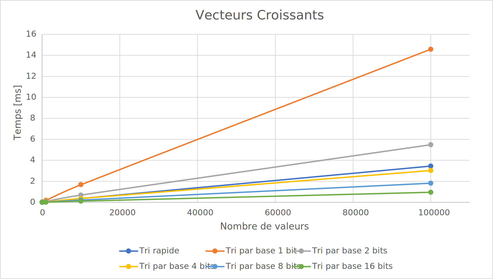
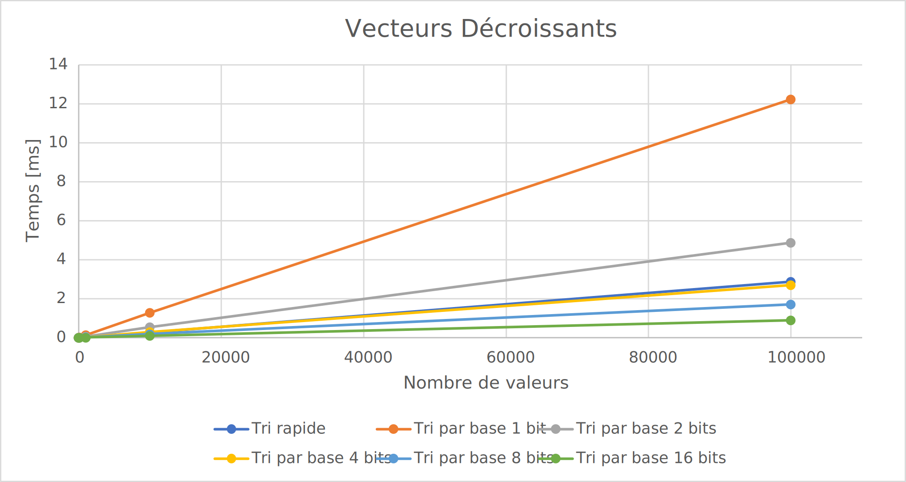
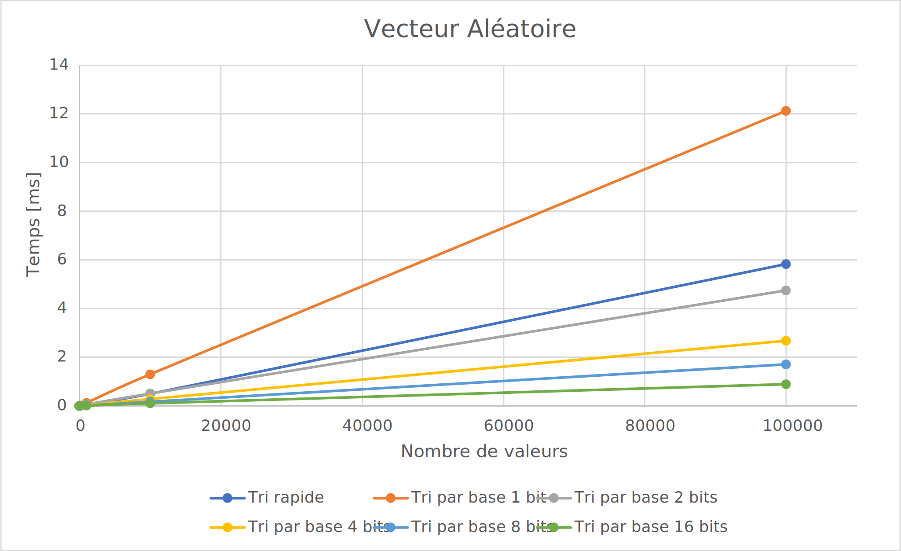
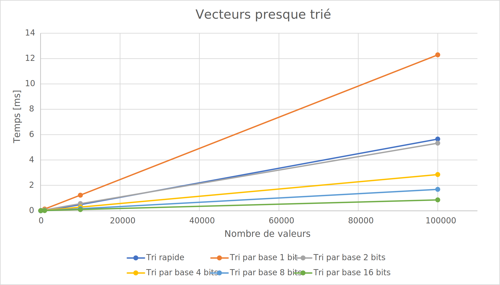

# L3 - Tris

## Introduction

Le but de ce rapport est de comparer la rapidité d'exécution du tri rapide et du tri par base avec des vecteurs générés aléatoirement d'une taille exponentielle logarithmique allant jusqu'à 1'000'000 d'éléments.

Le tri par base sera divisé par groupe de 1, 2, 4, 8 et 10 bits.

## Analyse

### Vecteur croissant

Le tri rapide est plus rapide que le tri par base 1 bit et 2 bits.

Cela est dû au faite que les nombres dans le vecteur sont de 3 bits maximum, donc le tri par base prendra plus de temps à s'effectuer.

Sinon, le tri par base 16 bits est le plus rapide.

### Vecteur décroissant

### Vecteur aléatoire

### Vecteur presque trié

[CSV Mesures](csv/mesure_temp.csv)

## Conclusion

