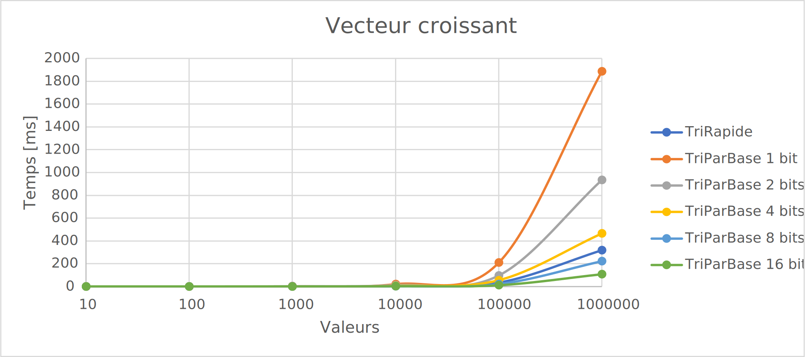
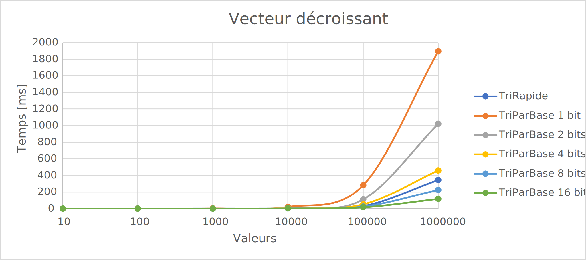
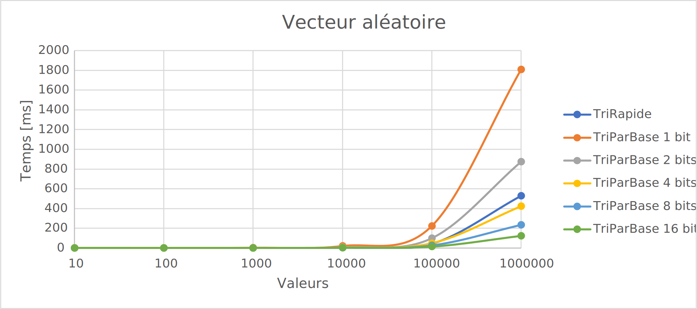
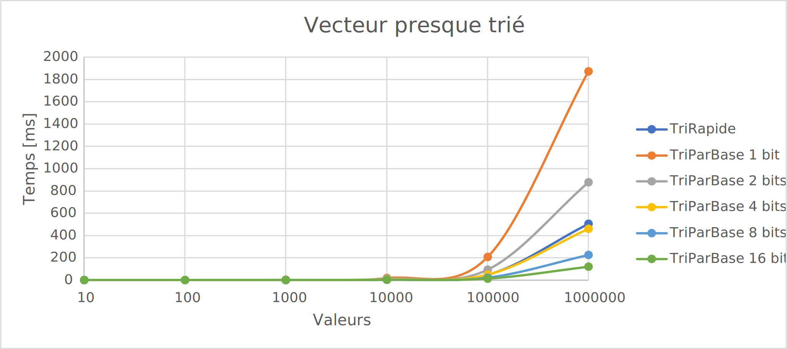

# L3 - Tris

## Introduction

Le but de ce rapport est de comparer la rapidité d'exécution du tri rapide et du tri par base avec des vecteurs générés de quatre façon différentes d'une taille exponentielle logarithmique allant de 10 jusqu'à 1'000'000 d'éléments.

Le tri par base sera divisé par groupe de 1, 2, 4, 8 et 16 bits.

## Analyse

### Vecteur croissant

Le tri rapide est plus rapide que le tri par base avec des blocs de 1 et 2 bits.

Cela est dû au fait que les nombres dans le vecteur sont de 3 bits maximum, donc le tri par base prendra plus de temps à s'effectuer.

Sinon, le tri par base 16 bits est le plus rapide.

[CSV Croissant](csv/Croissant.csv)

### Vecteur décroissant

Le graphe du temps de calcul pour un vecteur décroissant est étonnamment similaire à celui pour un vecteur croissant.

Le classement des différents tri reste dans le même ordre et ne subit qu'une très légère modification dans ses valeurs.

[CSV Décroissant](csv/Decroissant.csv)

### Vecteur aléatoire

Une fois de plus le graphe ressemble aux deux précédents.

Cependant, cette fois-ci le tri rapide est devancé par le tri par base avec des blocs de 4 bits alors que pour les deux autres type de vecteur, il était devant.

Les autres restent globalement très similaire.

[CSV Aleatoire](csv/Aleatoire.csv)

### Vecteur presque trié

Pour ce dernier graphe, le tri rapide est une fois de plus derrière le tri par base avec des blocs de 4 bits.

On voit maintenant que tous les graphes se ressemblent énormément.

[CSV Presque Trié](csv/PresqueTrie.csv)

### Tous les vecteurs

Tous les graphes se ressemblent énormément ce qui montre que les tris choisis ne sont pas particulièrement optimisés pour un certain type de vecteur.

Ceci veut donc aussi dire que les algorithmes ont une valeur moyenne de temps de calcul qui reste stable peu importe le type de vecteur qu'on lui donne.

De plus, les graphes nous montrent que pour peu d'éléments (environ 10 - 10'000) le temps de calcul est négligeable. Cependant dès qu'on a plus d'éléments le temps de calcul croit rapidement.

## Conclusion

On peut conclure de ces graphes que ces deux algorithmes sont très eficaces pour différents type de données surtout lorsqu'il y a moins de 10'000 éléments.

Pour peu d'éléments la différence d'efficacité entre les deux tris ne se remarque pas. Si on a beaucoup d'éléments à trier il vaut mieux choisir un tri par base avec des blocs de bits conséquents plutôt qu'un tri rapide.
